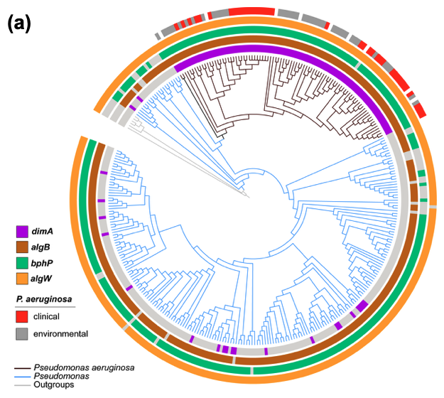
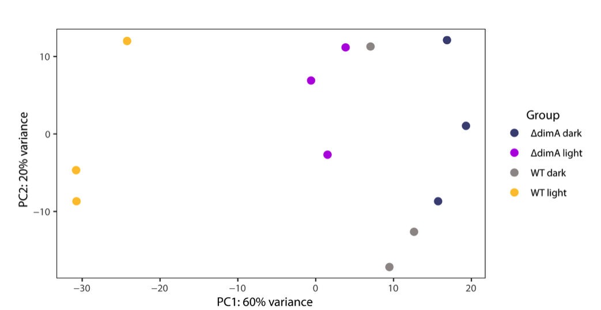

 
## **A light-induced microprotein triggers regulated intramembrane proteolysis to promote photo-sensing in a pathogenic bacterium**   
#####  Manias et al., 2025  

### RNAseq
##### Fig2D,E  
- raw RNAseq data here:
  
- pipeline for running RNAseq   
  `dimA_RNA_seq_2025/rnaseq_prokaryotes`  
  https://github.com/trestle-biosciences/rnaseq_prokaryotes.git    
- pipeline can be run here:    
 `dimA_RNA_seq_2025/rnaseq_prokaryotes/run_rnaseq_prokaryotes.ipynb`   
- runs fastQC, multiQC, trimgalore, bowtie2, subread FeatureCounts   
### DEseq2    
`dimA_RNA_seq_2025/multiple_comparisons.R`   
### Volcano plots and venn diagrams   
- pipeline can be run here   
  `dimA_RNA_seq_2025/rnaseq_prokaryotes/volcano_venn_diagrams.ipynb`    
### Results   
`results/analysis/`    
  

## Fig 4A. Annotated species tree  
1. Run `reciprocal_blast.ipynb` to download proteomes and generate reciprocal blast best hits
2. Run `annotated_Pseudomonas_tree.ipynb`
   to:   
   - generate a species tree via 120 concatenated aligned proteins via Parks et al 2018 bac120 method.   
   - make datasets files for annotating species tree in iTOL
        
   

#### PCA plot:
- Run `dimA_RNA_seq_2025/rnaseq_prokaryotes/PCA.ipynb`   
  Then   
  `dimA_RNA_seq_2025/rnaseq_prokaryotes/PCA_analysis.R`   
to generate PCA plot.   
`results/analysis/PCA_plot.pdf`      
   
		

